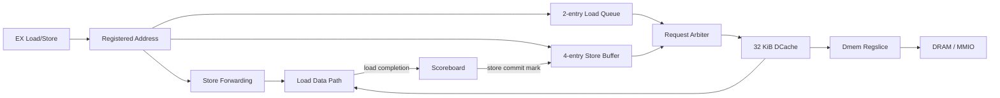

# CPU Core 架构、微架构与 PPT 绘图指南

> 文档日期：2026-07-14
> 设计依据：当前分支 `rtl/core/` 实际 SystemVerilog，而不是历史 README 中的 2-way OoO 规划。
> 适用对象：需要阅读、维护、汇报或继续演进当前 Core 的 RTL/架构工程师。

典型指令逐周期运行、LSU/DCache 和完整旁路矩阵见补充文档：[`pipeline_lsu_bypass_detailed_walkthrough.md`](pipeline_lsu_bypass_detailed_walkthrough.md)。

## 1. 先给出准确结论

当前 Core 是一个 RV32 单发射处理器，具有以下关键特征：

- 按程序顺序取指、译码和发射，每周期最多发射 1 条、提交 1 条。
- 没有物理寄存器重命名、PRF、通用 Issue Queue，也不能绕过一条阻塞在 ID 的指令去发射更年轻指令。
- 使用 8-entry Scoreboard 保存在途指令、结果和完成状态，允许 ALU、Load、MULDIV、Bitmanip 按不同延迟乱序完成。
- Scoreboard head 严格顺序提交，因此异常、CSR、寄存器写回和 Store 可保持精确顺序。
- 使用架构寄存器堆加 producer map，不是 Rename 架构。
- 前端包含 4-entry Fetch Queue、GShare 方向预测器、BTB 和 RAS。
- 数据侧包含 2-entry Load Queue、4-entry Store Buffer 和 32 KiB 直接映射 DCache。
- Store 在执行时进入 Store Buffer，提交后才允许产生外部写副作用。
- 分支解析时暂停发射年轻指令，因此分支错误预测只需清前端，不需要恢复后端 Rename/ROB checkpoint。

更准确的架构名称是：

> **单发射、顺序发射、乱序完成、顺序提交的 Scoreboard Core**

它比经典五级顺序流水线能够容纳更多在途指令，也能让独立指令越过长延迟指令完成；但它不具备通用乱序调度器的“跳过阻塞指令发射”能力。

如果汇报时直接称为“2-way 超标量乱序核”，会与当前 RTL 不符。建议在 PPT 中把“有限乱序能力”写成副标题，而不是画出不存在的 Rename/ROB/IQ/PRF。

## 2. 设计范围与关键参数

### 2.1 ISA 和特权范围

当前译码覆盖：

- RV32I 基础整数指令。
- RV32M 乘除法指令。
- Zicsr CSR 指令。
- `ECALL`、`EBREAK`、`MRET`、`FENCE`、`FENCE.I`。
- 六组可独立配置的 Zb 子集：Zba、Zbb、Zbc、Zbkb、Zbkx、Zbs。

六组 Zb 默认全部关闭。关闭后的 Zb 编码走非法指令异常，而不是等待未启用的 Bitmanip 单元。

当前没有实现：

- C 压缩指令。
- S/U 特权级。
- 中断接入和仲裁。
- MMU、TLB、虚拟地址。
- 原子 A 扩展。

### 2.2 核心静态参数

| 参数 | 当前值 | 微架构含义 |
|---|---:|---|
| XLEN | 32 | RV32 数据宽度 |
| Reset PC | `0x8000_0000` | 复位取指地址 |
| Fetch Queue | 4 entries | 吸收同步 IROM/预测器返回和后端短暂停顿 |
| Scoreboard | 8 entries | 最大在途指令窗口 |
| Store Buffer | 4 entries | 最大在途 Store 数 |
| Load Queue | 2 entries | 最大等待访存 Load 数，不含唯一 active transaction |
| BTB | 128 entries | 直接索引目标/类型表 |
| GShare GHR | 8 bits | 全局条件分支历史 |
| GShare PHT | 256 entries | 2-bit 饱和计数器表 |
| RAS | 8 entries | Return Address Stack |
| DCache | 2048 lines x 16 B | 32 KiB，直接映射 |
| Cacheable DRAM | `0x8010_0000`–`0x8013_FFFF` | 其余地址按 uncached/MMIO 处理 |

参数定义见 [`core_config_pkg.sv`](../../rtl/core/pkg/core_config_pkg.sv)，跨级 payload 定义见 [`core_types_pkg.sv`](../../rtl/core/pkg/core_types_pkg.sv)。

### 2.3 外部接口、时钟和复位

Core 使用单时钟、同步高有效 `rst`，没有内部 clock gating。`myCPU` 只负责把 `core_top` 端口适配到 SoC，不改变指令语义。

| 接口 | 方向 | 协议与约束 |
|---|---|---|
| IROM | Core 发 `addr/ena`，接收 `data` | 单独的取指通道；Frontend 用 pending metadata 对齐同步返回 |
| DMEM request | Core 发 valid/write/addr/data/strb/uncached，接收 ready | ready/valid；backpressure 时 register slice 保持完整 payload |
| DMEM response | Core 接收 valid/data | 没有 response ready；Core/DCache 保证受控的单事务响应接收 |
| Perf | Core 输出 64-bit counters | cycle、commit、branch、miss、load/store、cache、stall |
| Commit debug | 仿真输出 | 仅 `VERILATOR_TB` 编译；用于 DiffTest/日志，不进入 Vivado 数据通路 |

IROM 与 DMEM 是分离接口，属于 Harvard 风格外部边界；当前没有 ICache，一切指令存储延迟由 IROM 接口模型承担。

## 3. Core 总体结构

### 3.1 模块层次

```text
myCPU
└── core_top
    ├── frontend
    │   ├── branch_predictor  (BTB + GShare PHT/GHR + RAS)
    │   └── fetch_queue
    ├── decoder
    ├── regfile
    ├── scoreboard
    ├── operand_resolver
    ├── issue_control
    ├── fixed_execute         (ALU + Branch + AGU/alignment)
    ├── muldiv_unit
    ├── bitmanip_unit
    ├── store_buffer
    ├── load_queue
    ├── store_forwarding
    ├── memory_request_arbiter
    ├── load_data_path
    ├── dcache
    │   ├── dcache_tag_bank
    │   └── 4 x dcache_data_bank
    ├── dmem_regslice
    ├── csr_file
    ├── recovery_ctrl
    ├── perf_counters
    └── commit_trace_probe    (`VERILATOR_TB` only)
```

### 3.2 主数据流

```mermaid
flowchart LR
    IROM[IROM] --> FE[Frontend<br/>GShare + Fetch Queue]
    FE --> DEC[Decode]
    DEC --> ID[ID Holding Register]
    ID --> OR[Operand Resolver<br/>Issue Control]
    RF[Architectural RF] --> OR
    SB[8-entry Scoreboard] --> OR
    OR --> EXR[Execute Register]

    EXR --> FX[Fixed ALU / Branch / AGU]
    EXR --> MDU[MUL / DIV]
    EXR --> BM[Bitmanip]
    EXR --> LSU[Load / Store Path]

    FX -->|fixed completion| SB
    MDU -->|slow completion| SB
    BM -->|slow completion| SB
    LSU -->|load completion| SB

    SB --> CM[In-order Commit]
    CM --> RF
    CM --> CSR[CSR File]
    CM --> STB[Store Buffer commit mark]

    LSU --> LQ[Load Queue]
    LSU --> STB
    LQ --> ARB[Memory Arbiter]
    STB --> ARB
    ARB --> DC[DCache]
    DC --> RS[Dmem Regslice]
    RS --> DMEM[DRAM / MMIO]

    FX -. branch resolve .-> FE
    CM -. trap / mret / fence.i .-> FE
```

这张图表达了四条不同性质的路径：

1. 主指令流：IROM 到 Commit。
2. Completion 流：各执行单元按 transaction ID 返回 Scoreboard。
3. 架构状态流：Commit 更新 RF、CSR 和 Store committed 状态。
4. Recovery 流：Branch EX 或 Commit 事件重定向 Frontend。

## 4. 流水线阶段

当前 RTL 不是教材中固定的 IF/ID/EX/MEM/WB 五级。更适合按“寄存边界和功能责任”划分为下列阶段。

| 阶段 | 主要模块/寄存器 | 主要工作 | 可能停顿原因 |
|---|---|---|---|
| F0：Fetch Request | `frontend.fetch_pc_q` | 选择顺序/预测/重定向 PC，发 IROM 和预测器同步读 | Fetch Queue credit 不足、redirect |
| F1：Fetch Response | `pending_pc_q`、BTB/PHT read regs | 对齐指令和预测 metadata，压入 Fetch Queue | Queue 满 |
| D：Decode | `decoder`、`id_uop_q` | 生成 `uop_t`，保存到单条 ID holding register | ID 未被 issue 接收 |
| I：Read/Issue | `scoreboard` query、`operand_resolver`、`issue_control` | 找 producer、选旁路、检查 FU/队列 credit，分配 transaction ID | RAW、资源满、serialize、branch resolve |
| X：Execute | `exec_q`、Fixed/MDU/BM/LSU | ALU/Branch/AGU 或发起长延迟执行 | 各 FU 自身 busy |
| C：Complete | Scoreboard completion ports | 按 transaction ID 标记 done、保存结果/异常 | Load/MDU/DCache 可变延迟 |
| R：Retire | `commit_entry`、CSR/Recovery | Scoreboard head 顺序退休并产生架构副作用 | head 未 done、Store slot 无效、Fence 未 quiescent |
| W：RF Visibility | `wb_valid_q/wb_data_q`、RegFile | Commit 结果经过 WB bridge 写入架构 RF | 无独立 backpressure |

### 4.1 一条普通 ALU 指令的周期示例

假设无停顿，`N` 周期发出取指请求：

| 时钟沿 | 行为 |
|---|---|
| N | IROM、BTB、PHT 接收 Fetch Request |
| N+1 | 指令和预测结果返回，写入 Fetch Queue |
| N+2 | Decode 结果进入 `id_uop_q` |
| N+3 | 读操作数、分配 Scoreboard entry，写入 `exec_q` |
| N+4 | Fixed Execute completion 写入 Scoreboard，entry 变为 done |
| N+5 | Scoreboard head 提交，结果进入 Commit-WB bridge |
| N+6 | RegFile 物理写入完成 |

N+5 到 N+6 之间，消费者不必等 RegFile 真正写入，Commit-WB bypass 已经可以提供结果。

### 4.2 为什么 Completion 和 Commit 分开

执行完成只说明结果可用，不代表可以更新架构状态。长延迟 Load/Divide 可能使年轻独立 ALU 先完成，但 Commit 仍只从 Scoreboard head 前进。

如果把 completion 直接写 RF，会破坏：

- 异常时的精确寄存器状态。
- WAW 顺序。
- CSR/Store 与普通寄存器写回的一致提交点。
- DiffTest 的单条顺序提交接口。

## 5. Frontend 和 GShare 分支预测

### 5.1 Frontend 请求/返回配对

IROM 与 Branch Predictor 都是同步一拍返回。`pending_valid_q/pending_pc_q` 记录上一拍请求，使指令、PC 和预测 metadata 在 F1 对齐。

Frontend 用以下 credit 条件决定能否继续请求：

```text
queue_count + pending_valid < FETCH_QUEUE_DEPTH
```

这里必须把尚未返回的 pending request 算入占用，否则 Fetch Queue 可能在返回时溢出。

重定向时：

1. `irom_ena_o` 立即禁止新请求。
2. Fetch Queue flush。
3. `pending_valid_q` 清零，丢弃旧路径返回。
4. `fetch_pc_q` 写入 redirect target。
5. 下一周期从新 PC 发起请求。

### 5.2 GShare 组成

预测器由三部分并行工作：

| 结构 | 索引 | 内容 | 用途 |
|---|---|---|---|
| BTB | `PC[8:2]` | valid、tag、target、kind | 判断是否是已知控制流以及目标 |
| PHT | `PC[9:2] XOR GHR[7:0]` | 2-bit counter | 条件分支 taken/not-taken |
| RAS | Commit call/return 更新 | link address stack | Return 目标预测 |

PHT 状态解释：

```text
00 strongly not-taken
01 weakly not-taken   <- 未训练默认值
10 weakly taken
11 strongly taken
```

BTB hit 后：

- `PRED_COND`：PHT counter[1] 决定 taken。
- `PRED_JUMP`：直接使用 BTB target。
- `PRED_RETURN`：RAS 非空时优先 RAS top，否则退化到 BTB target。
- BTB miss：预测 `PC+4`。

RAS 在 call/return 正常 Commit 时更新，而不是在 Fetch 时投机 push/pop。这保证错误路径不会破坏栈，但紧跟在尚未提交 call 后的 return 可能暂时使用 BTB fallback。

### 5.3 为什么要携带 pred_index

GHR 会随着后续分支解析而变化，因此 EX 阶段不能使用“当前 GHR”重新计算旧分支的 PHT index。取指时计算出的 `pred_index` 和 `pred_counter` 会依次经过：

```text
fetch_entry_t -> uop_t -> exec_req_t -> branch update register -> predictor
```

训练时按原 index 饱和更新，避免写错 PHT 项。

### 5.4 GHR 更新策略

当前 GHR 只在条件分支得到真实结果后更新，不在 Fetch 时投机移入预测结果。

优点：

- 错误路径的普通取指不会直接污染 GHR。
- 不需要保存/恢复 history checkpoint。
- redirect 路径简单，适合当前没有后端分支 checkpoint 的架构。

代价：

- 分支解析之前发出的后续预测使用较旧的 GHR。
- 对连续紧密相关分支，相关性利用不如带 speculative GHR rollback 的高性能前端。

### 5.5 分支处理的特殊策略

当 `exec_q` 中的分支正在解析时，`issue_control` 禁止新指令发射。这样即使 Fetch Queue 和 ID 中已经有年轻指令，也不会有年轻指令进入后端 Scoreboard/FU。

因此分支错误预测恢复只需：

- flush Fetch Queue；
- 清 ID valid；
- 重定向 Fetch PC。

它不需要 full-flush Scoreboard、LoadQueue、StoreBuffer。这个策略牺牲一个分支解析周期的发射带宽，换取不需要分支 checkpoint 的简单精确恢复。

如果删除 `branch_resolve_i` 对 issue 的阻塞，错误路径年轻指令可能已经进入 Scoreboard、LoadQueue 或 StoreBuffer，当前仅清前端的恢复逻辑将不再正确。

## 6. Decode、ID Holding 和发射控制

### 6.1 Decode 输出

`decoder` 把 32-bit 指令转换为 `uop_t`，其中包含：

- PC、原始指令和预测 metadata。
- rs1/rs2/rd 及 uses/writes 标志。
- immediate。
- FU 类型和具体 ALU/Branch/MULDIV/Bitmanip 操作。
- Load/Store size、符号扩展控制。
- CSR/System 控制。
- decode exception、cause、tval。

默认先把指令标成 illegal，再由合法 opcode 分支清除 exception。这种写法能保证漏译码编码不会静默执行成 NOP。

### 6.2 单条 ID Holding Register

`id_uop_q` 只有 1 项：

- 空闲时从 Fetch Queue 接收一条译码结果。
- `issue_fire=0` 时保持不变。
- 成功发射后清 valid，或同拍由下一条 Fetch Queue head 覆盖。
- redirect 时无条件清 valid。

这意味着处理器是顺序发射：ID 头部指令 RAW 或资源阻塞时，不能选择更年轻独立指令。

### 6.3 Issue 条件

`issue_fire` 需要同时满足：

```text
ID valid
AND 源操作数 ready
AND 目标 FU/LoadQueue/StoreBuffer 有 credit
AND serialize 条件满足
AND Scoreboard 有空间，或本周期 head 正在 commit
AND 当前不是 branch resolve
AND 当前不是 redirect
```

Load/Store 的 rs1 使用专门的 `src1_memory_ready`，普通 ALU/Branch 使用 `src1_ready`。这是为了隔离 Load completion 到下一条地址生成的长旁路。

### 6.4 资源 credit 的前视

LoadQueue/StoreBuffer credit 不只看当前 count，还把 `exec_q` 中即将入队的 Load/Store 算进去。否则 ID 可能在队列只剩一个空位时连续发射两条访存指令并造成溢出。

Scoreboard 满时允许同拍 commit + issue：commit 释放的 slot 直接作为新 allocation credit。若 allocate pointer 与 commit pointer 相同，Scoreboard 时序逻辑保证年轻 allocation 最后覆盖旧 entry 的 clear。

## 7. Scoreboard：有限乱序的核心

### 7.1 Scoreboard 保存什么

每个 entry 对应一个 transaction ID，保存：

- occupied、done。
- PC、instruction。
- rd、writes_rd、result。
- FU 类型。
- CSR/System metadata。
- exception/cause/tval。
- Store Buffer slot。
- call/return 和 link address。

Scoreboard 同时维护：

- `allocate_ptr`：下一条发射指令位置。
- `commit_ptr`：最老未提交指令位置。
- `count`：窗口占用。
- `producer_valid[32]` 和 `producer_tid[32]`：每个架构寄存器的 youngest producer。
- `serial_pending`：是否存在未提交 serialize 指令。

### 7.2 为什么 producer map 能替代 Rename

发射仍然严格有序，因此可以为每个架构寄存器记录最年轻在途写者：

```text
rs -> producer map -> transaction ID -> Scoreboard result/done
```

新写 rd 的指令分配时覆盖 producer map，解决 WAW。旧写者提交时只有在 producer map 仍指向自己时才清 valid，避免错误清掉年轻写者。

这不是物理寄存器重命名：

- 多个版本只存在于 Scoreboard entry 中。
- RF 只保存已提交架构值。
- 没有 Free List、SpecRAT、ArchRAT。
- 阻塞在 ID 的消费者无法被更年轻指令绕过。

### 7.3 Completion 端口

Scoreboard 有三类 completion：

| 端口 | 来源 | 典型指令 |
|---|---|---|
| fixed completion | `fixed_execute` | ALU、Branch、Store、地址对齐异常 |
| load completion | `load_data_path` | DCache/uncached/Store forwarding Load |
| slow completion | MDU 或 Bitmanip mux | MUL/DIV/REM/Zb |

三类 completion 可以在同一周期命中不同 transaction ID，所以允许多个结果同拍完成；Commit 仍然每周期最多一条。

### 7.4 同周期更新优先级

Scoreboard normal path 的文本/NBA 优先级是：

```text
completion write -> commit clear -> younger allocation
```

这个优先级处理满窗口下同 slot commit + allocate。年轻 allocation 必须最终保留。如果把 allocation 放到 commit 前面，新 entry 可能被同拍 clear。

`flush` 优先级高于 normal update，清除全部 Scoreboard 投机状态和 producer map。

## 8. 操作数解析与旁路网络

### 8.1 普通源操作数优先级

操作数按以下优先关系选择：

```text
Architectural RF / x0
    -> previous Commit-WB bypass
    -> youngest Scoreboard producer
    -> same-cycle fixed completion
    -> same-cycle load completion
    -> same-cycle slow completion
```

这不是简单的 EX/MEM/WB 三路旁路，而是“架构值 + 在途版本 + completion wakeup”的组合。

### 8.2 Commit-WB bypass

Commit 在一个时钟沿把 `wb_valid_q/rd/data` 寄存下来，RegFile 的 always_ff 在下一个时钟沿才看到该 valid。因此两者之间存在一周期可见性间隙。

Commit-WB bypass 专门覆盖这个间隙：

```text
Commit edge -> wb_q visible -> consumer issue -> next edge RF physical write
```

如果删掉该旁路，紧随已提交 producer 的消费者可能读到旧 RF 数据。

### 8.3 Completion bypass

Scoreboard 的 done/result 要在时钟沿后更新，但当前周期 completion 已经产生。为了不多停一拍，operand resolver 按 transaction ID 比较并直接选择 completion data。

优先级固定为 fixed > load > slow。正常情况下同一 transaction ID 不会同时从多个 completion 返回；优先级用于形成确定逻辑。

### 8.4 Load-to-address 特殊处理

Load completion 可以旁路给普通 ALU/Branch/store-data consumer，但不能直接驱动下一条 Load/Store 的地址 rs1：

```text
load_result -> ordinary src1/src2       允许
load_result -> src1_memory/AGU/request  禁止
```

Fixed completion 和 slow completion仍可以旁路到 memory address path。

这样做的原因是切断：

```text
DCache data -> load format/merge -> operand mux -> 32-bit AGU add
-> Store forwarding / memory arbitration -> DCache request
```

否则形成跨越 DCache 返回、旁路、AGU 和新请求控制的长组合路径。代价是 load-use-address 依赖至少多等 Scoreboard result 稳定一拍。

### 8.5 CSR 源旁路为什么独立

CSR 指令被 serialize，发射时 Scoreboard 必须为空，因此 CSR source 不需要通用 completion 网络。它只使用 RF 和 Commit-WB bypass。

这样避免 DCache/MDU completion 数据扇出到 CSR mux，减少大量逻辑上不可能成立的长路径。

## 9. 执行单元

### 9.1 Execute Register 和早期 AGU

`issue_fire` 时，Core 把 transaction ID、完整 uop、两个源操作数写入 `exec_q`。Load/Store 的有效地址同时写入独立的 `exec_mem_addr_q`：

```text
exec_mem_addr_q <= src1_memory_value + immediate
```

`fixed_execute` 内仍保留等价的 `mem_addr_o` 计算用于异常判断，但真正进入 Store forwarding、LoadQueue 和 DCache 请求路径的是已经寄存的 `exec_mem_addr_q`。

这一拍 retiming 把 32-bit 地址加法从 Cache metadata/仲裁控制前移，改善实现时序。如果错误地改回组合 AGU 直连 DCache，请重点检查 LoadQueue/StoreBuffer 到 RAM enable 的 setup path。

### 9.2 Fixed Execute

Fixed Execute 是组合执行块，处理：

- 整数加减、逻辑、比较和移位。
- LUI/AUIPC。
- 条件分支比较。
- JAL/JALR 目标和 link result。
- Load/Store 地址对齐检查。
- Store slot metadata completion。

分支的真实下一 PC：

```text
conditional: taken ? PC + imm : PC + 4
JAL:         PC + imm
JALR:        (rs1 + imm) & ~1
```

错误预测判断不依赖 `pred_hit`，而是直接比较：

```text
actual_next_pc != predicted_next_pc
```

因此 BTB target 错误、方向错误、RAS target 错误都统一进入同一恢复路径。

### 9.3 MULDIV

MULDIV 是单事务 busy 单元：

- MUL 类使用 `MUL_0`，通过 3-bit valid shift 对齐固定流水延迟。
- DIV/REM 使用 `DIV_0`，保存 op、operand 和 transaction ID 直到输出有效。
- 有符号除法先取绝对值，输出后恢复 quotient/remainder 符号。
- 除零和 `INT_MIN / -1` 按 RISC-V 特例处理。

`kill_i` 不一定能停止底层 Vivado IP。设计通过 `killed_q` 抑制返回 completion，并等待原始 IP response 到来后释放 busy，防止 late response 写入已 flush 的 Scoreboard slot。

### 9.4 Bitmanip

Bitmanip 单元受六组 compile-time config 控制：

- 大多数 Zb 操作为组合计算加一拍 registered response。
- Zbc 的 CLMUL/CLMULH/CLMULR 使用 32 次迭代的 carry-less shift/XOR datapath。
- 配置关闭时 `req_ready=0`，但 decoder 会把相关编码保留为 illegal exception，因此不会死锁等待。

MULDIV 与 Bitmanip 共享 slow completion port。Issue Control 保证迭代引擎互斥，RTL assertion 也要求 MDU 和 BM 不得同拍 response。

## 10. Load/Store 微架构

### 10.1 总体结构



### 10.2 Store 生命周期

一条合法对齐 Store 经历：

1. Issue 时分配 Scoreboard transaction ID。
2. EX 计算并寄存地址，生成 data、size。
3. 写入 Store Buffer tail，记录 `store_seq`、address、wdata、wstrb、uncached。
4. Fixed completion 把 Store Buffer slot 写入对应 Scoreboard entry，并标记 done。
5. Store 到达 Scoreboard head 时正常 commit，对该 slot 置 committed。
6. Memory Arbiter 只允许 committed 的 Store Buffer head 请求 DCache。
7. 请求被 DCache 接受后 drain head。

架构提交与外部写发生可以相隔若干周期，但外部写永远不会早于 commit。

### 10.3 Store Buffer flush

full flush 时不能简单清空整个 Store Buffer：

- 未 committed Store 属于投机状态，必须删除。
- 已 committed Store 已经是架构副作用的一部分，必须保留并继续 drain。

flush 会扫描所有 entry，保留 committed 项，重新计算 count/tail。head 和 sequence 连续性保持。

如果异常 flush 把 committed Store 一起清除，会出现“指令已经退休但内存写消失”的精确状态错误。

### 10.4 Store-to-Load forwarding

Load 在 EX 时扫描当前 Store Buffer：

- 只对 cacheable DRAM Load 启用转发。
- 比较 word address `addr[31:2]`。
- 按 Store Buffer 从 oldest 到 youngest 扫描。
- 后扫描的年轻 Store 覆盖相同 byte lane，形成 youngest-wins。
- 结果保存为 4-bit byte mask 和 32-bit forward data。

Load 发射有序，所以此时 Store Buffer 中所有可见 Store 都比该 Load 更老。`store_seq_cutoff` 进一步保存年龄边界，供 uncached ordering 检查。

Store sequence 是 8-bit 环形编号，年龄比较使用半区间差值：非零差值且最高位为 0 才视为 older。由于 Store Buffer 只有 4 项，最大在途距离远小于 128，编号回绕时比较仍无歧义。

转发分两种：

| 类型 | 行为 |
|---|---|
| queued full forwarding | Load 已在 LoadQueue head 且所需 byte 全覆盖，不访问 DCache，直接 completion |
| direct-start full mask | EX Load 可能已被 DCache 当拍接受；仍等待 response，但结果 byte 全由 forwarding data 覆盖 |
| partial forwarding | 访问 DCache，response 按 byte mask 与 Store data 合并 |

### 10.5 Load Queue 和 direct-start

Load Queue 深度为 2，另外最多有一个已经被 DCache 接受、等待 response 的 active Load。

优化路径：当 Load Queue 为空且新 Load 满足访问规则时，它可以直接向 DCache 发请求，不必先入队再出队。若 DCache 当拍未接受，则 Load metadata 入队等待。

LoadQueue update 的重要覆盖顺序：

```text
old completion clears active
-> direct start or queued memory start sets new active
```

因此旧 Load completion 和新 Load start 可以同拍交接，不产生 active 气泡。

### 10.6 Cacheable 与 uncached ordering

Cacheable Load 可以越过仍在 Store Buffer 中的 older Store，因为重叠 byte 已通过 forwarding snapshot 保证正确。

Uncached/MMIO Load 不能这样做。它只有在以下条件成立时才能发请求：

- 没有任何 older Store pending。
- 自己的 transaction ID 等于 Scoreboard commit pointer，即它位于提交头。

这保证 MMIO read 不会越过更老内存副作用，也不会在可能被异常清除时提前产生不可回滚的外设访问。

### 10.7 Memory Arbiter 优先级

固定优先级为：

```text
committed Store Buffer head
    > EX direct Load
    > Load Queue head
```

Store 最高优先级有助于释放 Store Buffer，并确保已提交副作用尽快离开 Core。已经进入 LoadQueue 的 full-forward head completion 不会占用 DCache 端口。

## 11. DCache 和外部内存接口

### 11.1 Cache 组织

当前 DCache：

- 容量 32 KiB。
- 16-byte cache line，4 个 32-bit word。
- 2048 lines，直接映射。
- Tag/valid 使用同步 Block RAM。
- Data 拆成 4 个 word bank，每 bank 为 2048 x 32-bit Block RAM。
- Cacheable 范围固定为 256 KiB DRAM window。

### 11.2 Load hit pipeline

Cacheable Load 请求被接受时，同时发起同步 tag 和 data bank 读取。下一周期：

- tag hit：直接输出选中 word 的 response。
- tag miss：进入 refill FSM。

Load hit completion 周期可以同时接受下一条不冲突请求，因此稳定命中流可以达到每周期一个访问的前端吞吐。

### 11.3 Miss refill

Refill 以请求 word 为 critical word first：

1. 从 miss word 对齐地址发第一个外部 read。
2. 第一个 response 立即返回给 CPU，同时写入对应 data bank。
3. 后续依次请求剩余 3 个 word，2-bit word index 自然回绕。
4. 最后一拍写 tag/valid，整条 line 生效。

当 refill 中发生 kill，已被外部接受的请求仍必须等待 response 并 drain，但 `killed_q` 阻止它更新 Scoreboard 或错误返回给新路径。

### 11.4 Store policy

DCache Store 策略是：

- write-through：所有 Store 都发往下层 memory/MMIO。
- update-on-hit：cacheable Store hit 时同步更新命中 data bank。
- no-write-allocate：Store miss 不触发 line refill。

Store lookup 单独占一拍，以保证 cache bank update 在后续 Load 观察该 word 前完成。

### 11.5 初始化

Tag RAM 没有大规模 reset。复位后 `DC_INIT` FSM 每周期写一个 invalid tag，2048 周期后进入 IDLE。

这种方式保留 Block RAM 推断，避免为整个 tag array 加 reset 后被综合成大量 FF/LUT。初始化期间 DCache 不接受访问，因此启动代码需要自然等待 Cache ready。

### 11.6 Dmem register slice

Core/DCache 到 SoC DMEM 之间有一个 non-fall-through 单 entry register slice：

- 请求 payload 和 valid 被寄存。
- 下游 backpressure 时完整 payload 保持不变。
- response 也打一拍返回 DCache。
- DCache hit 不经过该 slice，因此不会增加 hit latency。

它切断 LoadQueue/DCache arbitration 到 SoC ready/valid 的长组合路径，是 FPGA implementation 友好的关键边界。

## 12. Commit、CSR、异常和恢复

### 12.1 Commit ready

Scoreboard head 满足 `occupied && done` 才能提交，并附加：

- Store：其记录的 Store Buffer slot 必须仍 valid。
- `FENCE/FENCE.I`：要求 StoreBuffer、LoadQueue、active Load、DCache 和 MDU quiescent。

每周期最多提交 1 条。年轻 entry 即使早已 done，也不能越过 head。

### 12.2 架构副作用

正常 Commit 可能产生：

- GPR Commit-WB。
- CSR read-modify-write。
- Store Buffer committed mark。
- RAS call push / return pop。
- instret/performance counter 更新。

异常 entry 也会 `commit_fire`，但 `commit_normal=0`，因此不会写 GPR、CSR 普通值或提交 Store。

### 12.3 CSR serialize

CSR/System/Fence 指令带 `serialize`：

1. 只有 Scoreboard 空时允许发射。
2. 分配后设置 `serial_pending`，阻止后续普通指令发射。
3. System entry 在分配时即可标记 done，等待到 head Commit 执行架构动作。
4. Commit 或 exception 后清 serial 状态。

这种策略避免 CSR 与更老/更年轻指令之间复杂的 forwarding、重放和权限排序。

### 12.4 精确异常

异常来源包括：

- Decode illegal instruction。
- ECALL/EBREAK。
- Load/Store address misaligned。
- Instruction target misaligned。

异常 metadata 保存于 Scoreboard，只有到达 commit head 时才：

- 写 `mepc/mcause/mtval/mstatus`。
- full flush 后端投机状态。
- redirect 到 `mtvec`。

所以年轻指令即使已经 completion，也不会先产生架构写回。

### 12.5 Recovery 优先级

重定向目标优先级：

```text
exception -> mtvec
mret      -> mepc
fence.i   -> current PC + 4
branch miss -> branch actual next PC
```

`full_flush` 只用于 exception、MRET、FENCE.I。Branch miss 只产生 frontend redirect，因为分支解析周期已经禁止年轻指令进入后端。

各资源在 full flush 时的行为：

| 资源 | flush 行为 |
|---|---|
| Fetch Queue / ID | 全清 |
| Scoreboard / producer map | 全清 |
| Execute valid | 清除 |
| Load Queue / active Load | 清除，DCache kill late response |
| MDU / iterative Bitmanip | kill/suppress late response |
| Store Buffer | 清未提交项，保留 committed 项 |
| CSR architectural state | 仅按 trap/mret 规则更新，不回滚 |

## 13. Stall、Flush 和控制优先级

### 13.1 主要 stall 类型

| Stall | 形成条件 | 直接影响 |
|---|---|---|
| RAW | producer 存在且未 done，且无 completion bypass | ID 保持 |
| memory resource | LoadQueue/StoreBuffer credit 不足 | Load/Store ID 保持 |
| MULDIV/BM busy | 对应单元不能接收 | 长延迟指令 ID 保持 |
| serialize | Scoreboard 非空或已有 serial pending | CSR/System/Fence 保持 |
| Scoreboard full | 8 项全占用且本拍不 commit | 所有新 issue 阻塞 |
| branch resolve | 分支正在 EX 比较 | 禁止年轻 issue |
| redirect | 前端恢复周期 | 禁止 issue，清 ID/FQ |

### 13.2 关键优先级

建议审查 RTL 时按以下优先级检查：

1. Reset 覆盖所有 normal update。
2. Full flush 覆盖 Scoreboard/LoadQueue/Execute normal update。
3. StoreBuffer flush 保留 committed entry，而不是全清。
4. ID redirect clear 覆盖 fetch/issue hold。
5. Scoreboard normal path 内 allocation 最后覆盖 reused slot。
6. LoadQueue normal path内新 start 覆盖旧 completion 的 active clear。
7. CSR trap 更新优先于普通 CSR write/mret。

## 14. 典型时序案例

### 14.1 独立 ALU 越过长延迟 DIV 完成

```text
I0: DIV x5, x1, x2   -> tid0，进入 MDU busy
I1: ADD x6, x3, x4   -> tid1，下一周期 fixed completion
I2: XOR x7, x8, x9   -> tid2，下一周期 fixed completion
```

Scoreboard 可能出现：

```text
tid0: occupied=1 done=0
tid1: occupied=1 done=1
tid2: occupied=1 done=1
```

I1/I2 已乱序完成，但 commit pointer 停在 tid0。DIV 返回后依次提交 tid0、tid1、tid2。这体现“乱序完成、顺序提交”。

### 14.2 RAW completion bypass

```text
I0: ADD x5, x1, x2
I1: XOR x6, x5, x3
```

I1 在 ID 查询到 x5 的 producer tid。I0 fixed completion 到来的同周期，Scoreboard done 尚未时钟更新，但 operand resolver 直接匹配 transaction ID，把 completion result 旁路给 I1，减少一拍停顿。

### 14.3 Load 后接地址相关 Load

```text
I0: LW x5, 0(x1)
I1: LW x6, 0(x5)
```

I0 的 DCache completion 可以作为普通数据旁路，但不能驱动 I1 的 memory address source。因此 I1 必须等 x5 进入稳定 Scoreboard result，再执行 AGU。这个额外周期是有意的 timing tradeoff。

### 14.4 Store forwarding

```text
I0: SB x2, 1(x1)
I1: SH x3, 2(x1)
I2: LW x4, 0(x1)
```

I2 扫描 StoreBuffer，把 I0/I1 覆盖的 byte lane 合并。若只覆盖部分 word，则 DCache response 提供其余 byte；若四个 byte 全覆盖且 I2 已进入 LoadQueue，则可以不访问 DCache。若 I2 在 EX direct-start 时已被 DCache 接受，仍会等待 response，但最终所需 byte 全部由 forwarding data 覆盖。

### 14.5 分支错误预测

1. Branch 位于 `exec_q`，计算 actual next。
2. 同周期 `branch_resolve_i` 阻止年轻 ID issue。
3. actual next 与 pred next 不同，结果打一拍形成 `branch_miss`。
4. Frontend flush Fetch Queue/ID，设置 redirect PC。
5. Scoreboard 中没有错误路径年轻指令，因此不做 backend full flush。
6. Branch 本身正常写 completion，之后按序提交。

### 14.6 老异常和年轻已完成指令

```text
I0: misaligned LW     -> exception entry
I1: independent ADD   -> 可能已经 done
```

Commit 到 I0 时更新 trap CSR 并 full flush。I1 的 done result 仅存在于 Scoreboard，从未写入架构 RF，因此被安全丢弃。

## 15. FPGA 综合与 Implementation 友好性

### 15.1 已采用的时序/资源措施

- `flatten_hierarchy=rebuilt`：允许 Vivado 跨模块优化后重建可观察层级。
- BTB 使用 Block RAM；GShare PHT 使用 Distributed RAM。
- DCache tag/valid 和四个 data bank 使用同步 Block RAM inference template。
- DCache tag 用初始化 FSM，不给大 RAM 加 reset。
- RegFile 只物理维持 x0 为零，不 reset x1-x31 的 1024 数据位。
- AGU 地址提前寄存，避免加法落在 Cache/arbiter 前。
- Dmem register slice 切断 Core 到 SoC backpressure 长路径。
- CSR source 不接通用 completion mux。
- Load completion 不接 memory address bypass。
- Branch recovery/predictor update 打一拍，避免 EX compare 直接扇出全局控制。

### 15.2 可能的关键路径

Implementation 时建议重点观察：

1. Scoreboard producer map -> entry select -> operand mux -> issue enable。
2. fixed completion compare/bypass -> execute register D input。
3. StoreBuffer scan -> forwarding byte merge。
4. LoadQueue/StoreBuffer state -> memory arbiter -> DCache request control。
5. DCache tag compare -> hit response mux。
6. Commit head decode -> CSR/flush/redirect control。
7. GShare PC XOR GHR -> PHT RAM address，以及 BTB/PHT response -> next PC mux。

不要仅根据 RTL 模块边界猜关键路径；`rebuilt` 会跨层级优化。应从 routed timing report 的 startpoint/endpoint 和完整 logic levels 判断。

### 15.3 当前性能边界

- 峰值 issue/commit IPC 均为 1，不可能达到 2 IPC。
- ID head-of-line blocking 是主要结构限制。
- 每个分支解析周期强制禁止 issue，正确预测分支也有一个局部发射气泡。
- LoadQueue 只有 2 项、active memory transaction 只有 1 项。
- MULDIV 单事务 busy，DIV 期间不能再接 MUL/DIV。
- DCache hit 可流水，但 miss/refill 独占下层端口。

## 16. 验证和调试观察点

### 16.1 DiffTest 提交边界

`commit_trace_probe` 在 Commit 边界采样：

- PC、instruction。
- rd/wdata/wen。
- trap/cause/next PC。
- Load/Store 地址、数据、mask。

DiffTest 比较的是已提交架构行为，不直接比较内部 completion 顺序。因此乱序完成合法，但任何年轻结果提前进入 RF/CSR/MMIO 都会被检测为提交不一致。

### 16.2 建议波形分组

| 波形组 | 关键信号 |
|---|---|
| Frontend | request PC、pending PC、FQ count、pred next、redirect |
| Issue | id valid、uop、src ready、producer tid、issue fire |
| Scoreboard | allocate/commit ptr、count、completion tid、head done |
| Branch | pred next、actual next、resolve、miss、GHR/PHT update |
| Load | LQ count、active meta、DCache req/resp、load result |
| Store | SB head/tail/count、committed、drain、forward mask |
| Commit | commit fire、entry、WB bridge、CSR trap/mret |

### 16.3 必须保持的 assertions/不变量

- Scoreboard/LoadQueue/StoreBuffer count 不超过深度。
- completion transaction ID 必须命中 occupied Scoreboard entry。
- MDU 和 Bitmanip 不得同拍返回 slow completion。
- 外部 Store 请求必须来自 valid + committed StoreBuffer head。
- Uncached Load 必须位于 commit head 且无 older Store。
- 下游 backpressure 时 DMEM request payload 必须稳定。
- `branch_miss -> !issue_fire`。
- `commit_count <= cycle_count`，`branch_miss <= branch_count`。

## 17. 如何用 PowerPoint 画出详略得当的 Core 架构图

### 17.1 先决定一张图表达什么

不要试图在一张图同时展示所有 RTL 模块、全部信号和每个时序细节。推荐分为 4 张图：

| 页 | 主题 | 观众应该获得的结论 |
|---|---|---|
| 1 | Core 总体架构 | 单发射、Scoreboard、四类执行/完成路径、顺序提交 |
| 2 | Hazard 与旁路 | producer map、completion bypass、特殊 load-address 隔离 |
| 3 | Load/Store 子系统 | Store commit、forwarding、LoadQueue、DCache 和 uncached ordering |
| 4 | 分支与恢复 | GShare、分支 EX 暂停 issue、frontend redirect、精确异常 full flush |

汇报时间不足时，第 1 页作为主图，第 2–4 页作为逐层放大图。

### 17.2 主架构图推荐布局

使用 16:9 页面，打开“视图 -> 参考线/网格线”，按下面的横向布局：

```text
左侧 0%                                                          右侧 100%

[IROM] -> [Frontend] -> [Decode/ID] -> [Operand/Issue] -> [EX Register]
                         ^                  ^                |
                         |                  |                +--> [Fixed ALU/Branch]
                         |                  +--- [RegFile]   +--> [MULDIV]
                         |                  +--- [Scoreboard]+--> [Bitmanip]
                         |                                   +--> [Load/Store]
                         |
              <---------------- Commit / Recovery -------------------------

下方：[Store Buffer] [Load Queue] -> [Arbiter] -> [DCache] -> [Dmem Slice] -> [DMEM/MMIO]
右下：[Completion Buses] -> [Scoreboard] -> [Commit/CSR]
```

建议将页面划成三条水平带：

- 上带 20%：Frontend 和预测。
- 中带 45%：Decode、Issue、Execute、Scoreboard、Commit 主流水。
- 下带 25%：Load/Store 和 Memory hierarchy。
- 剩余 10%：标题、图例和关键参数。

### 17.3 主图只保留这些方框

主图控制在 12–15 个方框：

1. IROM。
2. Frontend（内部小字：GShare/BTB/RAS/FQ）。
3. Decoder + ID。
4. RegFile。
5. Operand Resolver + Issue Control。
6. Execute Register。
7. Fixed ALU/Branch/AGU。
8. MULDIV。
9. Bitmanip。
10. Load/Store Unit。
11. Scoreboard。
12. Commit + CSR/Recovery。
13. LoadQueue + StoreBuffer。
14. DCache。
15. Dmem Regslice + DMEM/MMIO。

不要在主图单独画：

- 每个 ALU opcode。
- 每个 CSR 寄存器。
- DCache 六个 FSM state。
- Store forwarding 的每个 byte mux。
- 所有 perf/debug 信号。

这些内容放到放大页或旁注。

### 17.4 颜色和线型规范

建议最多使用 5 种语义颜色：

| 颜色 | 用途 | 示例 |
|---|---|---|
| 深蓝 | 主指令/数据流 | Fetch -> Decode -> Issue -> Execute |
| 橙色 | Completion 和旁路 | FU -> Scoreboard、completion -> operand |
| 绿色 | 架构状态/Commit | Commit -> RF/CSR/Store committed |
| 红色 | Flush/Redirect/异常 | Branch/Commit -> Frontend |
| 灰色虚线 | Ready/Credit/控制 | Scoreboard full、FU busy、queue count |

线宽建议：

- 主数据流 2.25 pt。
- Completion/Commit 1.75 pt。
- 控制虚线 1.25 pt。
- 方框边线 1.25 pt。

所有箭头使用 PowerPoint connector，不要用普通直线，否则移动方框后连接关系会断开。

### 17.5 方框内部文字层级

每个方框最多三层信息：

```text
Scoreboard              <- 16–18 pt，模块角色
8 entries               <- 11–12 pt，关键容量
OOO complete / in-order commit <- 10–11 pt，核心语义
```

不要把 RTL signal 名全部写进方框。只在箭头上标少数跨模块 payload：

- `fetch_entry_t`
- `uop_t`
- `exec_req_t`
- `tid + result`
- `addr/data/mask`
- `redirect PC`

### 17.6 主图的正确箭头

必须画出的回路：

1. Scoreboard -> Operand Resolver：producer/done/result 查询。
2. Completion buses -> Scoreboard：按 transaction ID 完成。
3. Completion buses -> Operand Resolver：同周期 wakeup bypass。
4. Commit -> RegFile/CSR/StoreBuffer：架构状态更新。
5. Fixed Branch -> Frontend：branch miss redirect。
6. Commit/Recovery -> Frontend：trap/mret/fence.i redirect。
7. Load/Store -> LoadQueue/StoreBuffer -> DCache。

容易画错的箭头：

- 不要画 Load completion -> AGU 的直接旁路；当前明确禁止。
- 不要画 Store EX -> DMEM 直接写；必须经过 StoreBuffer committed。
- 不要画 EX exception -> CSR 直接写；必须到 Commit。
- 不要画 Fetch speculative GHR update；当前 GHR 在 branch resolve 更新。
- 不要画 DCache 接在 IROM 上；指令和数据接口分离。

### 17.7 Hazard/旁路放大页

这一页以 Operand Resolver 为中心：

```text
RegFile -----------\
Commit-WB ----------\
Scoreboard result ----> [Operand Resolver] -> [Issue] -> [EX Register]
Fixed completion -----/
Load completion ------/   (仅普通 operand)
Slow completion ------/
```

在 Load completion 线上加一个红色短注：

```text
blocked for memory-address src1
```

右侧用一个小表写 Issue gates：RAW、queue credit、FU busy、serialize、Scoreboard credit、branch resolve、redirect。

### 17.8 Load/Store 放大页

把 Store 和 Load 分上下两条泳道：

```text
Store lane:
EX -> StoreBuffer speculative -> Scoreboard commit mark -> committed head -> DCache -> DMEM

Load lane:
EX -> Store forwarding -> direct/LQ -> DCache -> merge/extend -> Scoreboard completion
```

用红色竖线标出“Commit boundary”。Store 外部副作用只能出现在竖线右侧。

把 arbiter 优先级写在方框旁：

```text
1 committed store
2 direct load
3 queued load
```

### 17.9 分支/恢复放大页

左侧画 GShare：

```text
PC -> BTB -> target/kind
PC xor GHR -> PHT -> direction
RAS -> return target
```

右侧画两条恢复路径：

```text
Branch EX mismatch -> registered miss -> Frontend flush/redirect
Commit exception/mret/fence.i -> full flush -> Frontend redirect
```

在 Branch EX 到 Issue Control 画一条红色控制线并标：

```text
block younger issue during resolve
```

这条线解释了为什么 branch miss 不需要清后端，是整张恢复图最重要的设计意图。

### 17.10 PowerPoint 实际操作步骤

1. 页面设置为 16:9，启用参考线、网格吸附。
2. 先画三条浅灰色区域标题：Frontend、Execution/Commit、Memory。
3. 创建一个标准模块方框，统一尺寸、字体、边框，再复制，不要逐个手调。
4. 使用“对齐 -> 顶端对齐”和“横向分布”排主流水方框。
5. 先画深蓝主数据流，再画绿色 Commit，最后叠加橙色 completion 和红色 recovery。
6. 所有折线使用肘形连接符，尽量从方框固定连接点出发。
7. 交叉不可避免时，用线条跳跃或把控制线移到图外侧绕行。
8. 给每条跨区总线加 1 个短标签，不重复标每根信号。
9. 右下角加颜色/线型图例，并注明“single issue / in-order issue / OOO complete / in-order commit”。
10. 最后缩放到 50% 检查：若文字看不清，说明主图信息过多，应移到放大页。

### 17.11 架构图自检清单

- [ ] 图中是否明确写了 single issue，而不是 2-way？
- [ ] Scoreboard 是否画成 8-entry in-flight/result/commit structure，而不是 Rename ROB？
- [ ] 是否没有画不存在的 PRF、RAT、FreeList 和 Issue Queue？
- [ ] 是否区分 completion 与 commit？
- [ ] Store 是否在 commit 后才连向外部写？
- [ ] Load completion 到普通 operand 和 memory-address operand 是否区分？
- [ ] Branch miss 是否只清前端，并画出 resolve 时禁止年轻 issue？
- [ ] Exception 是否在 Commit 更新 CSR并 full flush？
- [ ] GShare 是否画出 `PC xor GHR -> PHT`，BTB 是否单独提供 target/kind？
- [ ] IROM 和 DCache/DMEM 是否分开？
- [ ] 箭头颜色和线型是否有统一语义？
- [ ] 主图是否能在不放大的情况下读懂？

## 18. 一页汇报时的推荐文案

标题：

> RV32 单发射 Scoreboard Core 微架构

副标题：

> In-order issue, out-of-order completion, in-order commit

图旁只放 6 条结论：

1. 8-entry Scoreboard 跟踪在途指令和 youngest producer。
2. Fixed/Load/Slow 三类 completion 支持不同延迟乱序完成。
3. Commit 每周期一条，保证 GPR/CSR/Store 精确顺序。
4. GShare + BTB + RAS，一拍同步预测。
5. 4-entry StoreBuffer、2-entry LoadQueue、32 KiB write-through DCache。
6. Completion bypass 与 Load-address timing isolation兼顾 IPC 和 FPGA Fmax。

## 19. RTL 联动阅读顺序

建议按以下顺序读代码：

1. [`core_config_pkg.sv`](../../rtl/core/pkg/core_config_pkg.sv)：容量和特性配置。
2. [`core_types_pkg.sv`](../../rtl/core/pkg/core_types_pkg.sv)：跨级 payload。
3. [`core_top.sv`](../../rtl/core/core_top.sv)：全局互连、Commit 和控制边界。
4. [`frontend.sv`](../../rtl/core/frontend/frontend.sv) 与 [`branch_predictor.sv`](../../rtl/core/frontend/branch_predictor.sv)：取指和预测时序。
5. [`decoder.sv`](../../rtl/core/decode/decoder.sv)：ISA 到 uop。
6. [`scoreboard.sv`](../../rtl/core/issue/scoreboard.sv)：在途状态、producer map、顺序提交入口。
7. [`operand_resolver.sv`](../../rtl/core/issue/operand_resolver.sv) 与 [`issue_control.sv`](../../rtl/core/issue/issue_control.sv)：hazard、旁路和发射条件。
8. [`fixed_execute.sv`](../../rtl/core/execute/fixed_execute.sv)、[`muldiv_unit.sv`](../../rtl/core/execute/muldiv_unit.sv)、[`bitmanip_unit.sv`](../../rtl/core/execute/bitmanip_unit.sv)。
9. [`store_buffer.sv`](../../rtl/core/memory/store_buffer.sv)、[`load_queue.sv`](../../rtl/core/memory/load_queue.sv)、[`memory_request_arbiter.sv`](../../rtl/core/memory/memory_request_arbiter.sv)。
10. [`dcache.sv`](../../rtl/core/memory/dcache.sv) 与 [`dmem_regslice.sv`](../../rtl/core/memory/dmem_regslice.sv)。
11. [`csr_file.sv`](../../rtl/core/commit/csr_file.sv) 与 [`recovery_ctrl.sv`](../../rtl/core/control/recovery_ctrl.sv)。

阅读每个模块时始终问四个问题：

1. 这个状态由谁拥有？
2. valid/ready 或 allocate/complete/commit 的握手边界在哪里？
3. flush 时哪些状态应该清，哪些架构副作用必须保留？
4. 同一周期多个事件发生时，NBA 最终优先级是什么？

回答清楚这四点，才能在后续扩展双发射、Issue Queue 或 Rename 时保持当前精确语义。

## 20. 最小实践任务：手写一个简化 Scoreboard Core

目标不是复制完整工程，而是用约 5 个 RTL 文件掌握当前设计最关键的机制。

### 20.1 功能边界

只实现：

- 32-bit 定长指令输入，假定 Fetch 已完成。
- `ADD/SUB/AND/OR/XOR` 五种 ALU 操作。
- 单发射、4-entry Scoreboard、顺序提交。
- 一个 1-cycle ALU 和一个固定 4-cycle Slow ALU。
- 32 x 32-bit 架构 RegFile。
- producer map、Scoreboard result forwarding 和 same-cycle completion bypass。

暂不实现：

- Branch、Load/Store、CSR、异常。
- Rename/PRF/Issue Queue。
- Cache 和外部总线。

### 20.2 建议文件

```text
mini_types_pkg.sv
mini_scoreboard.sv
mini_operand_resolver.sv
mini_slow_alu.sv
mini_core.sv
```

### 20.3 实现步骤

1. 定义 `uop_t`、`completion_t` 和 2-bit transaction ID。
2. 写 4-entry Scoreboard，先只支持 allocate、fixed completion、commit。
3. 增加 `producer_valid/tid[32]`，验证 RAW 和 WAW。
4. 写 Operand Resolver，实现 RF -> Scoreboard -> completion 的选择。
5. 加固定 4-cycle Slow ALU，让年轻普通 ALU 可以先完成但不能先提交。
6. 实现同拍 commit + allocate，并检查 reused slot 最终保存年轻 entry。
7. 最后加一个 flush 输入，确认所有在途 producer 被清除但 RF 保持已提交值。

### 20.4 最小测试序列

```text
1. ADD x1, x0, 1
2. ADD x2, x1, 2          # RAW + completion bypass
3. SLOW x3, x2, 3         # 老长延迟
4. ADD x4, x0, 4          # 年轻指令先完成
5. ADD x3, x0, 5          # WAW，producer map 必须指向年轻 x3
6. ADD x5, x3, 6          # 必须依赖第 5 条，不是第 3 条
```

验收标准：

- 发射顺序与程序顺序一致。
- 第 4 条可以比第 3 条先 done。
- Commit 顺序仍为 1、2、3、4、5、6。
- 第 6 条读取第 5 条产生的 x3。
- 任意时刻 flush 后，没有旧 completion 能写入新分配 slot。

完成这个练习后，再增加 LoadQueue/StoreBuffer；不要一开始就加入 Cache、分支预测和 CSR，否则很难区分数据相关、内存顺序和恢复问题。
