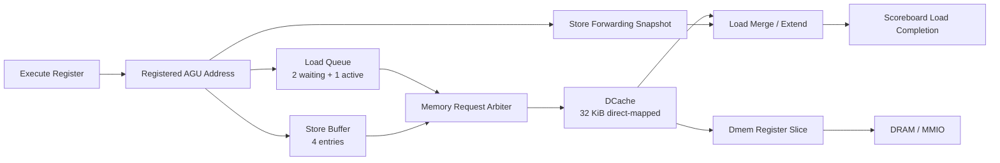
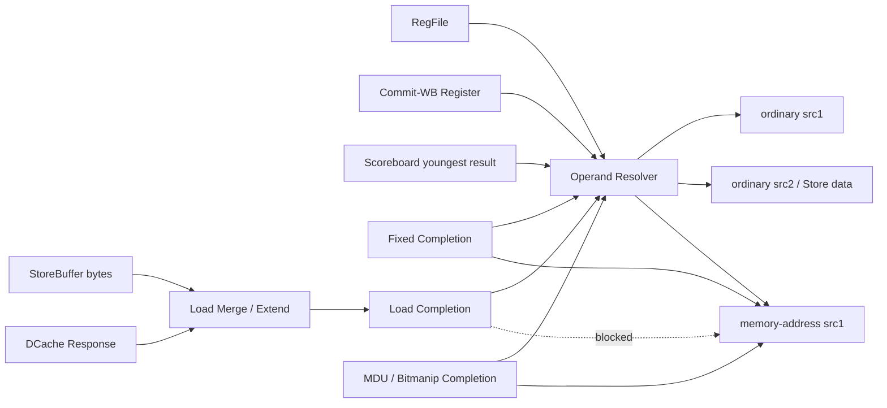

# 流水线、Load/Store 与旁路逐周期详解

> 本文是 [`cpu_core_microarchitecture_and_ppt_guide.md`](cpu_core_microarchitecture_and_ppt_guide.md) 的实例化补充。
> 所有描述均以当前 `rtl/core/` 为准，重点回答：指令每拍如何流动、DCache/LSU 如何工作、哪些结果能前递以及哪些路径被有意禁止。

## 1. 阅读约定

### 1.1 当前 Core 的执行边界

当前处理器是：

```text
single issue
in-order issue
out-of-order completion
in-order commit
```

它不是通用乱序发射：ID 中的指令如果阻塞，年轻指令不能绕过去。但是一条指令成功发射后，后续独立指令可以继续发射，并可能比老的 DIV/Load 更早完成。

### 1.2 周期表怎么读

本文用 `T0、T1、T2...` 表示两个相邻上升沿之间的组合计算周期：

```text
       T0                 T1                 T2
edge0 ---- combinational ---- edge1 ---- combinational ---- edge2
```

“T0 issue”表示 `issue_fire` 在 T0 周期有效，并在 T0 末尾的上升沿完成：

- Scoreboard allocate。
- `exec_q` 捕获 uop、transaction ID 和操作数。
- `exec_mem_addr_q` 捕获 Load/Store 有效地址。

Completion 也是周期内组合有效、周期末写入 Scoreboard。Commit 条件读取的是已经寄存的 `done`，所以刚产生 completion 的指令不会在同一个上升沿直接提交。

### 1.3 主要寄存边界

```text
IROM/BTB/PHT synchronous read
    -> Fetch Queue
    -> ID holding register (id_uop_q)
    -> Execute register (exec_q + exec_mem_addr_q)
    -> Scoreboard done/result
    -> Commit-WB register (wb_*_q)
    -> Architectural RegFile
```

后续例子多数从“指令已经位于 ID”开始，这样可以聚焦数据相关、执行和提交；Frontend 的 F0/F1 延迟对每条指令统一存在。

## 2. 典型指令段的流水运行过程

### 2.1 示例一：连续独立 ALU 指令

```asm
I0: add  x3, x1, x2
I1: xor  x4, x5, x6
I2: sub  x7, x8, x9
```

假设 Fetch Queue 已准备好、Scoreboard 为空、无分支/资源阻塞。

| 周期 | ID/Issue | Execute/Complete | Scoreboard/Commit | 周期末主要状态变化 |
|---|---|---|---|---|
| T0 | I0 issue | 无 | 无 | allocate tid0；`exec_q=I0`；ID 换入 I1 |
| T1 | I1 issue | I0 fixed completion | tid0 尚未 done | tid0.done=1；allocate tid1；`exec_q=I1` |
| T2 | I2 issue | I1 fixed completion | I0 commit | 清 tid0；tid1.done=1；allocate tid2；WB bridge 保存 I0 |
| T3 | 下一条可 issue | I2 fixed completion | I1 commit | tid2.done=1；WB bridge 保存 I1 |
| T4 | 持续运行 | 后续 completion | I2 commit | WB bridge 保存 I2 |

稳态下可以做到：

- 每周期 issue 1 条。
- 每周期 fixed completion 1 条。
- 每周期 commit 1 条。

峰值 IPC 为 1，因为 issue 和 commit 都是单宽度。

#### 关键理解

ALU completion 在 T1 周期已经产生，但到 T1 末尾才写 Scoreboard。I0 最早在 T2 被 Commit 逻辑看到 `done=1`。

如果错误地把 completion 和 commit 合成一个组合大路径，会形成：

```text
ALU result -> exception/result mux -> Scoreboard head -> CSR/RF/flush
```

不仅难以满足时序，也会让可变延迟 completion 的精确提交更难维护。

### 2.2 示例二：背靠背 ALU RAW，使用 fixed completion bypass

```asm
I0: add  x5, x1, x2
I1: xor  x6, x5, x3
I2: and  x7, x6, x4
```

| 周期 | producer/ready 状态 | 旁路行为 | Issue 结果 |
|---|---|---|---|
| T0 | I0 分配 tid0，producer[x5]=tid0 | 无 | I0 issue |
| T1 | tid0.done 仍为 0，但 I0 fixed completion 有效 | completion.tid==tid0，x5 直接前递给 I1 | I1 不停顿，issue |
| T2 | I1 对 x6 的 fixed completion 有效 | completion.tid==tid1，x6 前递给 I2 | I2 不停顿，issue |

数据没有走：

```text
I0 -> Scoreboard done -> Commit -> RegFile -> I1
```

而是走：

```text
I0 fixed completion
    -> transaction ID compare
    -> Operand Resolver
    -> T1 末尾 I1 exec_q
```

这条旁路允许普通 ALU RAW 链达到每周期一条发射。

#### 删除会发生什么

如果删除 fixed completion bypass，I1 要等 T1 末尾 Scoreboard 写入 done/result，最早 T2 才能 issue，每级 RAW 链多一个气泡。

### 2.3 示例三：WAW 与 youngest producer

```asm
I0: div  x5, x1, x2     # 长延迟，tid0
I1: add  x5, x3, x4     # 年轻写 x5，tid1
I2: xor  x6, x5, x7     # 应依赖 I1，不应依赖 I0
```

状态变化：

```text
I0 allocate: producer[x5] = tid0
I1 allocate: producer[x5] = tid1   # 覆盖为 youngest writer
I2 query:    source tid = tid1
```

I1 是普通 ALU，可能比 I0 的 DIV 更早 completion。I2 可以使用 I1 的 fixed completion 前递并继续 issue。

但是 Commit 仍然等待 I0：

```text
tid0 DIV done=0
tid1 ADD done=1
tid2 XOR done=1
commit_ptr -> tid0，不能越过
```

I0 最终提交时，Scoreboard 只有在 producer[x5] 仍指向 tid0 时才清 producer valid。现在它指向 tid1，所以不能清除。随后 I1 提交并成为 x5 的最终架构值。

#### 为什么没有 Rename 也能处理 WAW

多个未提交版本分别保存在 Scoreboard entry 中，producer map 只指向最年轻版本。这个机制能处理当前顺序发射窗口中的 WAW，但不等价于可扩展的 PRF Rename。

### 2.4 示例四：老 DIV 阻塞提交，年轻指令乱序完成

```asm
I0: div  x10, x1, x2
I1: add  x11, x3, x4
I2: xor  x12, x5, x6
I3: sub  x13, x7, x8
```

只要 I1–I3 不依赖 x10，它们可以继续顺序 issue，并很快 fixed completion：

| Entry | 指令 | done 可能状态 | 能否提交 |
|---|---|---:|---|
| tid0 | DIV | 0 | 否，Commit 卡在这里 |
| tid1 | ADD | 1 | 否，不能越过 tid0 |
| tid2 | XOR | 1 | 否，不能越过 tid0 |
| tid3 | SUB | 1 | 否，不能越过 tid0 |

DIV 返回后，Commit 每周期退休一条。这里体现的是“执行完成顺序可以变化，架构顺序不能变化”。

#### 结构上仍可能停住

如果 DIV 足够长，8-entry Scoreboard 会被填满。即使年轻 entry 全部 done，只要 head DIV 未完成，无法释放窗口，Frontend 最终会因 Scoreboard full 停止 issue。

通用 OoO Core 可以拥有更深 ROB 和更复杂调度；当前设计用小窗口换取面积和控制简单性。

### 2.5 示例五：正确预测与错误预测分支

```asm
I0: beq  x1, x2, target
I1: add  x3, x4, x5       # 已经到达 ID，但尚未 issue
```

#### 正确预测

| 周期 | Branch | I1 | Frontend |
|---|---|---|---|
| T0 | I0 位于 `exec_q`，计算 actual next | `branch_resolve_i=1`，I1 禁止 issue | 继续持有已预测路径 |
| T1 | I0 结果已经寄存 | I1 可以 issue | 无 redirect |

即使预测正确，分支解析周期 T0 也有一个 issue 气泡。这是当前“不让年轻指令越过未解析分支”的设计成本。

#### 错误预测

| 周期 | Branch/Recovery | ID/Backend | Frontend |
|---|---|---|---|
| T0 | actual next != pred next | I1 被禁止 issue | 旧路径可能仍在 FQ |
| T1 | registered `branch_miss=1` | redirect 再次禁止 issue；Scoreboard 不 full flush | FQ/ID flush，记录 redirect target |
| T2 | Predictor 完成 update | 后端没有错误路径年轻 uop | 从正确 PC 发新请求 |

Branch miss 不清 Scoreboard 的前提就是 T0 禁止 I1 issue。如果允许 I1 在 T0 进入后端，当前恢复逻辑将留下错误路径 entry。

### 2.6 示例六：精确异常清除年轻已完成结果

```asm
I0: lw   x5, 2(x1)       # 假设 word load，地址不对齐
I1: add  x6, x2, x3
I2: xor  x7, x4, x8
```

I0 在 Fixed Execute 检测 misaligned，completion 中记录：

```text
exception_valid=1
cause=load_address_misaligned
tval=effective_address
```

I1/I2 可能已经 issue 甚至 done，但结果仍只在 Scoreboard。I0 到达 commit head 时：

1. `commit_fire=1`，`commit_normal=0`。
2. CSR 写 mepc/mcause/mtval/mstatus。
3. redirect 到 mtvec。
4. full flush Scoreboard、LoadQueue、Execute 和前端。
5. I1/I2 从未提交，所以不会写架构 RF。

这就是精确异常。关键不是“异常一发现就停掉所有逻辑”，而是“异常 metadata 有序走到 Commit，年轻副作用在此之前不可见”。

## 3. Load/Store 与 DCache 详细说明

### 3.1 先把 LSU 拆成五个职责



| 部件 | 不负责什么 | 真正负责什么 |
|---|---|---|
| AGU | 不访问 Cache | 计算/寄存有效地址，检查对齐 |
| Store Buffer | 不是 Store Cache | 保存未提交/已提交但未 drain 的 Store |
| Load Queue | 不是通用 Memory IQ | 保存尚未被 DCache 接受的 Load，并记录一个 active Load |
| Store Forwarding | 不修改 Store 顺序 | 为年轻 Load 快照更老 Store 的 byte 数据 |
| DCache | 不决定精确提交 | 处理 hit/miss/refill、write-through 和 uncached 请求 |

### 3.2 地址分类

```text
0x8010_0000 <= address < 0x8014_0000  -> cacheable DRAM
其他地址                                  -> uncached / MMIO
```

RTL 依赖该窗口 256 KiB 自然对齐，所以用 `addr[31:18]` 比较，避免两个 32-bit 大小比较器进入关键路径。

地址分类影响：

| 行为 | Cacheable | Uncached/MMIO |
|---|---|---|
| Store-to-Load forwarding | 开启 | 关闭 |
| Load 是否可越过 older Store | 可以，依赖 forwarding 保证重叠 byte | 不可以 |
| Load 是否必须位于 commit head | 否 | 是 |
| DCache line lookup/refill | 是 | 否 |
| Store | write-through，hit 时更新 Cache | 直接外部写 |

### 3.3 Load Queue 的“2 waiting + 1 active”

`load_count_q` 只统计等待队列 entry，不包含已经被 DCache 接受的 active transaction。

所以最大形态是：

```text
active load: 1
waiting load queue: 2
total represented loads in LSU: up to 3
```

active metadata 保存：

- transaction ID。
- address、size、unsigned。
- store sequence cutoff。
- forwarding mask/data。

DCache response 本身不带 transaction ID，必须用 active metadata 找回它属于哪个 Scoreboard entry，以及如何做 byte 选择/符号扩展。

### 3.4 Direct-start 与排队

新 Load 到达 EX 时，如果 Load Queue 为空并满足顺序条件，Memory Arbiter 可以直接把它送到 DCache：

```text
EX Load -> DCache handshake -> active_meta
```

不需要：

```text
EX Load -> enqueue -> next cycle dequeue -> DCache
```

以下情况会进入 Load Queue：

- DCache 当前不能接受。
- committed Store head 获得更高仲裁优先级。
- 已有更老 waiting Load。
- uncached Load 尚未到 commit head。
- uncached Load 前面还有 older Store。

### 3.5 Cacheable Load hit 的逐周期过程

```asm
I0: lw x5, 0(x1)
```

假设地址对齐、DCache 已初始化、Load Queue 空、请求命中。

| 周期 | Core/LSU | DCache | 周期末状态 |
|---|---|---|---|
| T0 | I0 在 ID issue | 无 | allocate tid0；`exec_q=I0`；地址写 `exec_mem_addr_q` |
| T1 | EX Load direct candidate，请求 DCache | 接受请求并启动同步 tag/data read | `active_meta=I0`；DCache `lookup_valid=1` |
| T2 | `dc_resp_valid=1`，Load merge/extend 产生 result | tag hit，输出目标 word | Load completion 写 tid0；active 清除 |
| T3 | tid0.done 已可见 | 可继续流水 hit | 若 tid0 是 head，则 Commit |

从 issue 到 Load completion 比普通 ALU 多一个周期。DCache hit response 的 T2 周期可以被普通依赖消费者旁路使用，见第 4 节。

### 3.6 Load miss 和 critical-word-first refill

Load lookup miss 后进入：

```text
DC_IDLE lookup miss
-> DC_REFILL_REQ
-> DC_REFILL_WAIT
-> 重复 4 个 word
-> DC_IDLE
```

关键点：

1. Cache line 为 16 B，共 4 个 word。
2. `fill_word_q` 从 miss address 对应 word 开始。
3. 第一个外部 response 是 critical word，立即作为 CPU Load response。
4. 剩余 3 个 word 继续 refill，word index 2-bit 回绕。
5. 最后一拍才写 tag valid，整条 line 正式生效。

所以 CPU Load 可以在 line 完全填完前 completion，但 DCache 仍占用 refill FSM，后续访问可能继续等待。

如果 full flush/kill 发生：

- 尚未被外部接受的 refill request 可以取消。
- 已接受 request 的 response 必须 drain。
- `killed_q` 禁止 late response 形成 CPU completion 或污染已重用的 Scoreboard transaction ID。

### 3.7 普通 Load-use：允许 load completion bypass

```asm
I0: lw  x5, 0(x1)
I1: add x6, x5, x2
```

| 周期 | I0 | I1 |
|---|---|---|
| T0 | issue | 等待进入 ID |
| T1 | DCache request/lookup | producer[x5]=tid0，done=0，stall |
| T2 | DCache hit，load completion 有效 | completion.tid==tid0，x5 直接旁路，I1 issue |
| T3 | Scoreboard 已保存 Load result | I1 fixed completion |

因此 Load hit 到普通 ALU consumer 有一个等待周期，但不需要再等 Scoreboard done 后多停一拍。

### 3.8 Load-use-address：明确禁止 load completion 直达 AGU

```asm
I0: lw  x5, 0(x1)
I1: lw  x6, 0(x5)
```

T2 时 I0 的 Load completion 已经有效：

```text
ordinary src1_ready = 1
memory src1_ready   = 0
```

因为 I1 是 Load，它的 issue 条件使用 `src1_memory_ready`，所以 T2 不能 issue。T2 末尾 I0 result 写入 Scoreboard；T3 才从稳定 Scoreboard result 取得 x5 并执行 I1 AGU。

这条禁止路径切断了：

```text
DCache BRAM output
-> forwarding merge/sign extend
-> operand bypass mux
-> AGU adder
-> LoadQueue/StoreBuffer scan
-> DCache request enable
```

它是明确的频率取舍，不是遗漏的功能。

### 3.9 Load 结果作为 Store data 与 Store address

```asm
# A：Load 结果只作为 Store data
lw x5, 0(x1)
sw x5, 0(x2)

# B：Load 结果作为 Store address
lw x5, 0(x1)
sw x3, 0(x5)
```

- A 中 x5 是 Store `rs2`，走普通 `src2`，允许 load completion bypass。
- B 中 x5 是 Store `rs1` 地址基址，走 `src1_memory`，禁止 load completion bypass，必须多等 Scoreboard 稳定一拍。
- 如果地址和 data 都依赖同一 Load，地址限制已经阻塞整个 Store，下一周期两者都可从 Scoreboard 取得。

### 3.10 Store 的逐周期生命周期

```asm
I0: sw x5, 0(x1)
```

假设地址对齐且 I0 是 Scoreboard head。

| 周期 | Store 状态 | Scoreboard | 外部可见性 |
|---|---|---|---|
| T0 | ID issue | allocate tid0 | 无 |
| T1 | EX 形成 addr/data/size，准备 enqueue | fixed completion 带 store slot | 无 |
| T2 | StoreBuffer entry valid，但 committed=0 | tid0.done=1，可 commit | 仍无外部写 |
| T3 | commit 后 slot committed=1 | tid0 retired | 架构上 Store 已提交，但仍被 Buffer 承接 |
| T4 | Arbiter 选择 committed head，DCache/Regslice 接受 | 无 | 写请求进入 memory path，StoreBuffer drain |
| 后续 | Regslice 在 backpressure 下保持请求 | 无 | 下游 ready 后真正离开 Core |

最重要的边界是：

```text
Store EX/enqueue != Store architectural commit != external request accepted
```

这三个事件不能画成同一个方框或同一拍。

### 3.11 DCache Store policy

Store 采用：

```text
write-through
update-on-hit
no-write-allocate
```

具体行为：

- 所有 Store 都发往下层 memory/MMIO。
- Cacheable Store 同时做 tag lookup。
- 如果 hit，下一拍按 byte mask 更新 data bank。
- 如果 miss，不 refill cache line，外部写完成后结束。

Store lookup 多占一拍，避免下一条 Load 在 cache bank 尚未更新前读到旧值。

### 3.12 Store-to-Load forwarding：byte 级合并

```asm
I0: sb  x2, 1(x1)
I1: sh  x3, 2(x1)
I2: lw  x4, 0(x1)
```

假设三条访问同一个对齐 word。I2 在 EX 扫描 StoreBuffer：

1. 每个 Store 的原始 wstrb 按 address[1:0] 左移。
2. wdata 同样按 byte offset 左移。
3. 从 StoreBuffer oldest 扫到 youngest。
4. 同一 byte 被多次覆盖时，年轻 Store 最后写入 forwarding data，youngest wins。

可能得到：

```text
forward_mask = 1110
byte0 来自 DCache
byte1 来自 I0
byte2/3 来自 I1
```

DCache response 返回后：

```text
merged_word = (memory_data & ~forward_byte_mask)
            | (forward_data &  forward_byte_mask)
```

随后再根据 Load address offset 做移位，并按 LB/LBU/LH/LHU/LW 做符号或零扩展。

### 3.13 Full forwarding 的两个不同情况

当前 RTL 对 full mask 有两种行为，必须区分。

#### 情况 A：Load 已经排在 LoadQueue head

如果当前没有 active memory Load，且 LoadQueue head 所需 byte 全部被 forwarding mask 覆盖：

```text
load_forward_complete=1
-> 不发 DCache request
-> 直接用 forwarding data 形成 completion
```

若仍有更老 active Load 等待 response，full-forward head 也要先等 active transaction 完成，避免两个 Load completion 对 active/queue 状态产生冲突。

#### 情况 B：EX direct-start 已被 DCache 接受

Memory Arbiter 在 EX direct path 上没有使用当前 Load 的 full mask 阻止请求。如果 DCache 当拍 ready，Load 已成为 active transaction：

```text
仍等待 DCache response
-> merge 时所有所需 byte 都选择 forwarding data
```

结果正确，但没有省掉这次 Cache access。只有 queued head 的 full-forward path 当前具备真正的“跳过 DCache”优化。

### 3.14 多个 Store 的年龄和顺序

Store Buffer 使用 8-bit `store_seq`。Load 执行时保存 `store_seq_cutoff=next_store_sequence`。

年龄判断：

```text
delta = cutoff - store_seq
older = delta != 0 && delta[7] == 0
```

Store Buffer 只有 4 项，最大在途距离远小于 128，因此序号回绕也不会产生年龄歧义。

### 3.15 Cacheable Load 为什么能越过 older Store

Cacheable Load 允许发请求，即使存在 older Store：

- 地址重叠 byte 由 Store forwarding 提供。
- 地址不重叠时，读取 Cache/DRAM 不影响程序顺序。
- Load 自身仍只在 Scoreboard head 顺序提交。

Uncached/MMIO Load 不能依赖这种机制，因为外设 read 可能有不可重复副作用。因此它必须：

```text
no older Store pending
AND load trans_id == commit_ptr
```

### 3.16 Memory Arbiter 优先级

```text
1. committed StoreBuffer head
2. EX direct Load
3. LoadQueue head
```

优先级影响示例：

- Store 本周期刚 commit：committed bit 要到时钟沿后可见，最早下一周期参与仲裁。
- committed Store head 与 EX Load 同时存在：Store 胜，Load 入 LoadQueue。
- queued Load full-forward：不请求 DCache，直接 pop/complete。
- uncached queued Load：还要检查 older Store 和 commit head。

### 3.17 DCache FSM 逐状态理解

| 状态 | 作用 | 能否接收新 CPU request |
|---|---|---|
| `DC_INIT` | 每周期 invalid 一个 tag，共 2048 项 | 否 |
| `DC_IDLE` | 接收 Cache lookup 或 Store write-through | 视 lookup stall 而定 |
| `DC_UNC_REQ` | 向外部发送 uncached Load request | 否 |
| `DC_UNC_WAIT` | 等 uncached response | 否 |
| `DC_REFILL_REQ` | 发送当前 refill word request | 否 |
| `DC_REFILL_WAIT` | 等当前 refill word response | 否 |

Cacheable Load hit 时状态保持 `DC_IDLE`，所以 hit pipeline 可以在返回上一条 Load 的同周期接受下一条请求。Store lookup、Load miss、uncached access 会暂时阻塞新请求。

### 3.18 Dmem register slice 为什么存在

如果 DCache request 直接连接 SoC ready，可能形成：

```text
LoadQueue/StoreBuffer state
-> arbiter
-> DCache FSM/request mux
-> SoC/peripheral decode ready
-> Core issue/resource control
```

`dmem_regslice` 用一个 request entry 打断该路径。下游不 ready 时，valid 和完整 payload 必须保持稳定。它增加 miss/store/uncached 外部访问延迟，但不影响 DCache hit。

## 4. 当前旁路设计全景

### 4.1 先区分三类“前递”

当前工程中容易被统称为 bypass 的机制其实有三类：

| 类型 | 解决的问题 | 典型路径 |
|---|---|---|
| Register operand bypass | 新值尚未进入 RF | Commit-WB/Scoreboard/completion -> Operand Resolver |
| Completion wakeup bypass | producer 本周期刚完成，done 尚未寄存 | Fixed/Load/Slow completion -> Issue |
| Memory data forwarding | older Store 尚未写入 DCache/DRAM | StoreBuffer -> younger Load merge |

三者的 transaction/order 判断不同，不能混成一条“大旁路总线”。

### 4.2 旁路总图



### 4.3 完整旁路矩阵

“可”表示满足 producer/tid/valid 条件时可直接使用；“否”表示当前 RTL 明确没有该路径。

| 数据来源 | 普通 rs1 | 普通 rs2 | Load/Store 地址 rs1 | Store data rs2 | CSR source | Load result merge |
|---|:---:|:---:|:---:|:---:|:---:|:---:|
| Architectural RF | 可 | 可 | 可 | 可 | 可 | 否 |
| Commit-WB register | 可 | 可 | 可 | 可 | 可 | 否 |
| Scoreboard done/result | 可 | 可 | 可 | 可 | 否 | 否 |
| Fixed completion | 可 | 可 | 可 | 可 | 否 | 否 |
| Load completion | 可 | 可 | **否** | 可 | 否 | 否 |
| Slow completion | 可 | 可 | 可 | 可 | 否 | 否 |
| StoreBuffer forwarding | 否 | 否 | 否 | 否 | 否 | 可 |
| DCache response | 不直接 | 不直接 | 否 | 不直接 | 否 | 可 |

“DCache response 不直接到普通 operand”表示它先经过 Load merge/size/符号扩展形成 `load_result`，再以 Load completion 身份旁路。

### 4.4 Operand Resolver 的真实优先级

普通 rs1/rs2 的选择分两层。

#### 第一层：确定当前应该读哪个版本

```text
1. RF，x0 强制为 0
2. Commit-WB 覆盖 RF 的单周期可见性间隙
3. 如果 producer map 命中，Scoreboard youngest producer 覆盖 RF/WB
```

为什么 Scoreboard 在 Commit-WB 后面：

```asm
I0: add x5, ...      # 正在 Commit-WB
I1: add x5, ...      # 更年轻、仍在 Scoreboard
I2: xor x6, x5, ...
```

I2 必须等待/读取 I1，而不是使用 I0 的 Commit-WB。producer map 命中后，Scoreboard youngest 版本必须覆盖架构/提交版本。

#### 第二层：youngest producer 是否在本周期刚完成

只有 `producer_found=1` 且 completion transaction ID 等于 producer tid 时，才使用 completion bypass：

```text
fixed completion
else if load completion
else if slow completion
```

Completion 只带 transaction ID 和 result，不带“给任意同 rd 指令前递”的模糊匹配。transaction ID 必须精确等于当前源寄存器的 youngest producer。

### 4.5 Scoreboard result 与 completion bypass 的区别

#### Scoreboard result path

适用于 producer 已在之前时钟沿完成：

```text
entry.done=1
entry.result stable
-> source ready=1
-> issue
```

#### Completion bypass path

适用于 producer 本周期才完成：

```text
entry.done 仍为 0
completion.valid=1
completion.tid matches
-> 临时把 source ready 拉高
-> completion.result 直接进入 exec_q
```

没有 completion bypass 时功能仍可正确，但每个 producer/consumer 链会多等一个周期。

### 4.6 Commit-WB 为什么还需要旁路

Commit 与 RegFile 都在 posedge always_ff 中：

```text
edge N:   Commit 产生 wb_valid_q/wb_data_q
cycle N:  Operand Resolver 能看到 wb_q
edge N+1: RegFile 才根据旧的 wb_valid_q 完成写入
```

所以 cycle N 必须使用 WB bypass。否则 producer 已经从 Scoreboard 清除，consumer 又只能在 RF 中读到旧数据，形成一周期错误窗口。

### 4.7 Fixed completion 可以前递到哪里

来源包括 ALU、Branch link result，以及 Fixed Execute 产生的合法 result。

允许：

- ALU result -> 下一条 ALU/Branch operand。
- ALU result -> 下一条 Load/Store 地址 rs1。
- ALU result -> 下一条 Store data rs2。
- Branch/JAL/JALR link result -> 后续普通 consumer。

例如：

```asm
add x5, x1, x2
lw  x6, 0(x5)       # ALU fixed completion 可直接作为地址基址
```

两条可以背靠背 issue，因为 fixed completion 同时更新普通 `src1` 和 `src1_memory`。

### 4.8 Load completion 可以前递到哪里

允许：

- Load -> ALU rs1/rs2。
- Load -> Branch compare operand。
- Load -> JALR base（JALR 属于普通 Branch operand path，下一拍才计算 target）。
- Load -> Store data rs2。

禁止：

- Load -> Load address rs1。
- Load -> Store address rs1。
- Load -> CSR source。

例子：

```asm
lw  x5, 0(x1)
beq x5, x0, target  # 可在 load completion 周期 issue Branch

lw  x5, 0(x1)
jalr x0, 0(x5)      # 可在 load completion 周期 issue JALR

lw  x5, 0(x1)
sw  x5, 0(x2)       # x5 是 Store data，可旁路

lw  x5, 0(x1)
sw  x3, 0(x5)       # x5 是地址，不可旁路
```

### 4.9 Slow completion 可以前递到哪里

MDU 与 Bitmanip 共用 slow completion：

- 可以到普通 rs1/rs2。
- 可以到 Load/Store 地址 rs1。
- 可以到 Store data rs2。
- 不能到 CSR source，因为 CSR serialize 后不存在该合法并发需求。

例如：

```asm
div x5, x1, x2
lw  x6, 0(x5)
```

ID 中的 Load 会一直等待 DIV。DIV response 有效的周期，slow completion 同时把 `src1_ready` 和 `src1_memory_ready` 拉高，Load 可当周期 issue。

### 4.10 StoreBuffer forwarding 只服务 Load 数据

StoreBuffer forwarding 不参与寄存器操作数解析。它只解决：

```text
更老 Store 已经执行，但尚未写入 DCache/DRAM
年轻 Load 读取相同 byte
```

它的输出进入 `load_data_path`，与 DCache word 合并后才形成 Load completion。

不能把 StoreBuffer forwarding 画成：

- Store result -> ALU operand。
- Store data -> RegFile。
- Store data -> AGU base。

这些都不是当前设计的语义。

### 4.11 明确没有的旁路路径

#### 1. 没有 Load completion -> memory address

原因：切断 DCache response 到下一次 DCache request 的长组合环状路径。

#### 2. 没有通用 completion -> CSR source

原因：CSR serialize，发射时窗口必须为空；只需要 RF + Commit-WB。

#### 3. 没有 completion 直接写 RegFile

原因：必须先顺序 Commit，保持精确状态。

#### 4. 没有从年轻完成指令越过 Scoreboard head 提交

原因：completion 可以乱序，commit 不可以乱序。

#### 5. 没有绕过阻塞 ID 指令的调度旁路

原因：没有 Issue Queue/age scheduler。当前 operand 不 ready 时整条 ID 保持。

#### 6. 没有 Store EX -> external memory 的直接路径

原因：Store 必须先进入 StoreBuffer并在 Commit 标记 committed。

#### 7. 没有 DCache raw word -> consumer 的直接路径

原因：必须先处理 Store byte merge、address shift、LB/LH 符号/零扩展，并绑定 Load transaction ID。

### 4.12 旁路何时“不能用”

即使物理路径存在，以下情况仍不能前递：

- `uses_rs1/uses_rs2=0`，该字段不是有效源。
- 源寄存器为 x0，必须恒为 0。
- producer map 没有命中，说明应使用已提交 RF/WB 值。
- completion transaction ID 不是该源的 youngest producer。
- completion 被 flush/kill 抑制。
- Load consumer 是 memory-address rs1。
- CSR/System serialize 使用独立源路径。

### 4.13 几个旁路判断练习

#### 练习 A

```asm
add x5, x1, x2
add x6, x5, x3
```

答案：fixed completion -> ordinary rs1，可背靠背 issue。

#### 练习 B

```asm
lw  x5, 0(x1)
add x6, x5, x3
```

答案：Load hit response 周期 load completion -> ordinary rs1；需要等待 DCache hit 延迟，但无需再等 Scoreboard 一拍。

#### 练习 C

```asm
lw x5, 0(x1)
lw x6, 0(x5)
```

答案：load completion -> memory address 被禁止；等 Scoreboard result 稳定后 issue。

#### 练习 D

```asm
div x5, x1, x2
sw  x3, 0(x5)
```

答案：slow completion -> Store address允许，DIV response 周期即可 issue Store。

#### 练习 E

```asm
lw x5, 0(x1)
sw x5, 0(x2)
```

答案：load completion -> Store data rs2 允许；地址 x2 独立时可在 Load completion 周期 issue。

#### 练习 F

```asm
add  x5, x1, x2
csrrw x6, mstatus, x5
```

答案：CSR serialize 要等 Scoreboard 清空；不会使用 fixed completion。等 ADD 提交后，x5 通过 RF 或 Commit-WB 获取。

## 5. 把三部分连起来看

### 5.1 一段混合指令的完整分析

```asm
I0: add x5, x1, x2
I1: lw  x6, 0(x5)
I2: add x7, x6, x3
I3: sw  x7, 4(x5)
I4: lw  x8, 4(x5)
```

#### I0 -> I1

I0 fixed completion 可以前递到 I1 memory-address rs1，所以 I1 可背靠背 issue。

#### I1 -> I2

I2 是普通 ALU consumer。DCache hit 时，I1 load completion 可直接前递给 I2；I2 比 ALU RAW 多等待一个 Cache hit 周期。

#### I2 -> I3

I3 的 data x7 来自 I2，走 Store rs2 普通路径，fixed completion可前递。地址 x5 来自更早 I0，通常已在 Scoreboard done 或 RF/WB 中可用。

#### I3 -> I4

I4 执行时 I3 可能尚未 committed/drain。Store forwarding 快照 address `4(x5)` 的 word/byte 数据：

- 如果 I4 direct-start 已被 DCache 接受，则 response 返回后用 Store data 覆盖。
- 如果 I4 因 Store priority/DCache busy 进入 LoadQueue，full word mask 可以直接完成而不访问 DCache。

#### Commit

即使 I2/I4 的结果先完成，提交仍严格按 I0、I1、I2、I3、I4。I3 只有在 Commit 后才标记 committed 并允许写入 DCache/外部 memory。

### 5.2 分析任意指令段的固定方法

看到一段汇编时，按以下顺序分析：

1. 给每条指令标 FU：ALU、Branch、Load、Store、MULDIV、System、Bitmanip。
2. 标出 rs1/rs2/rd，并区分 Store 的 rs1=address、rs2=data。
3. 按顺序给在途写者分配 transaction ID。
4. 对每个源找到 producer map 指向的 youngest writer。
5. 判断 producer 是已 done、当拍 fixed/load/slow completion，还是仍未完成。
6. 如果是 Load/Store address rs1，单独应用“禁止 Load completion”规则。
7. 对 Load 检查 older Store forwarding mask、direct-start/queue、cacheable/uncached。
8. 对 Store 分开标记 enqueue、commit mark、drain 三个时间点。
9. 最后按 Scoreboard head 写 Commit 时间，不要按 completion 时间写。

## 6. 最容易混淆的结论

| 容易误解 | 当前 RTL 的准确结论 |
|---|---|
| Scoreboard 就是标准 ROB | 它承担部分 ROB/结果缓存职责，但没有 Rename/PRF，也不是通用 OoO ROB |
| done 就等于写回 RF | done 只表示 completion；必须等 head Commit |
| LoadQueue 深度 2，所以最多 2 条 Load | 还存在 1 个独立 active metadata，LSU 可表示最多 3 条 Load |
| Store commit 就是外部 ready | commit 只置 StoreBuffer committed，外部请求可更晚 |
| full forwarding 总能跳过 DCache | 只有 queued head full-forward 明确跳过；direct-start 可能已访问 DCache |
| 所有 completion 都能前递给所有 consumer | Load completion 明确不能到 memory address；CSR 也不接通用 completion |
| Branch miss 要清整个后端 | 当前 resolve 周期禁止年轻 issue，所以只清前端；异常/mret/fence.i 才 full flush |
| DCache Store miss 会 refill | no-write-allocate，只做 write-through |

## 7. 对照 RTL 阅读入口

- 流水互连和 Commit：[`core_top.sv`](../../rtl/core/core_top.sv)
- Scoreboard/producer map：[`scoreboard.sv`](../../rtl/core/issue/scoreboard.sv)
- 旁路选择：[`operand_resolver.sv`](../../rtl/core/issue/operand_resolver.sv)
- Issue gate：[`issue_control.sv`](../../rtl/core/issue/issue_control.sv)
- ALU/Branch/AGU：[`fixed_execute.sv`](../../rtl/core/execute/fixed_execute.sv)
- StoreBuffer：[`store_buffer.sv`](../../rtl/core/memory/store_buffer.sv)
- LoadQueue：[`load_queue.sv`](../../rtl/core/memory/load_queue.sv)
- Store forwarding：[`store_forwarding.sv`](../../rtl/core/memory/store_forwarding.sv)
- Memory priority/order：[`memory_request_arbiter.sv`](../../rtl/core/memory/memory_request_arbiter.sv)
- Load merge/extend：[`load_data_path.sv`](../../rtl/core/memory/load_data_path.sv)
- Cache FSM：[`dcache.sv`](../../rtl/core/memory/dcache.sv)
- Core/SoC timing cut：[`dmem_regslice.sv`](../../rtl/core/memory/dmem_regslice.sv)

建议实际看波形时，把 `id_uop_q`、`issue_fire`、`exec_q`、三个 completion、Scoreboard allocate/commit pointer、LoadQueue active、StoreBuffer committed 和 DCache state 放在同一个时间窗口。只看 PC 或 RF 最终值很难理解中间为何停顿。
